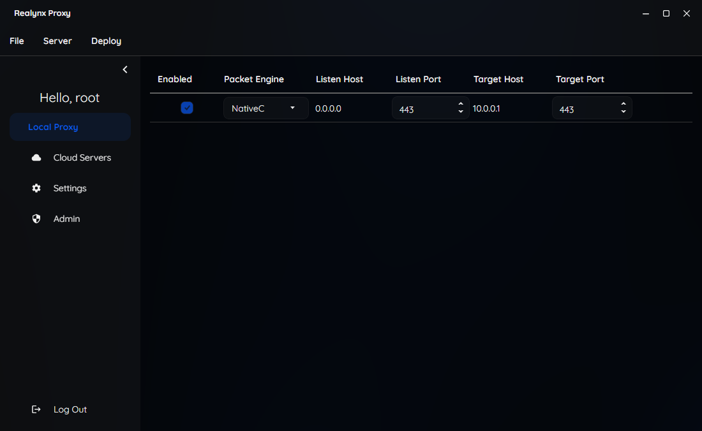

# Realynx Proxy  

**Realynx Proxy** is a cross-platform toolkit for building and running high-performance network proxies. It provides both terminated and pass-through proxy engines with support for TCP and UDP, integrating seamlessly with platform-specific packet filters like **netfilter** (Linux) and **Windows Packet Filter** (Windows).  

Realynx was designed to be flexible, modular, and developer-friendly. Whether you need a GUI client, command-line tools, or an API to integrate into your own systems, Realynx has you covered.  

---

## ✨ Features  

- **Cross-platform** – Runs on Windows, Linux, and macOS.  
- **Proxy Engines** – Supports both TCP/UDP terminated proxies and transparent packet pass-through.  
- **Multiple Interfaces**  
  - 🖥️ **GUI Client** – A downloadable cross-platform client for managing proxies visually.  
  - 📝 **CLI Example App** – Simple command-line tool to demonstrate Realynx in action.  
  - 📦 **Proxy API Library** – Core library (C# and C++) for building custom proxy applications.  
  - 🌐 **Web API Server** – REST API interface to manage proxies remotely with authentication.  
- **Authentication with OneKey** – A unique schema encoding both credentials and server network addresses into a single portable key. Just copy & paste the key from the server terminal into the client to log in—no extra setup required.  
- **High Performance** – Packet engines written in optimized **C#** and **C++**.  
- **Unit Tested** – Full suite of unit tests to ensure stability and reliability.  

---

## 📦 Components  

### GUI Client  
A full-featured, cross-platform desktop client for configuring and monitoring proxies.  

### CLI Example  
A minimal example for quickly testing and learning how Realynx works.  

### Proxy API Library  
The reusable core library providing all proxy functionality. You can import this into your own applications.  

### Web API Server  
Exposes the proxy library through secure, authenticated endpoints. Supports **OneKey** login.  

---

## 🚀 Getting Started  

1. **Download the GUI Client** (recommended for end users).  
2. **Use the CLI Example** to run quick tests and demos.  
3. **Integrate the Proxy API Library** into your own project if you’re a developer.  
4. **Run the Web API Server** to manage proxies remotely via REST calls.  

---

## 🖼️ Screenshots  

Here’s a preview of the **Local Proxy** management interface:  

  

---

## 🔑 Authentication – OneKey  

Instead of juggling separate credentials and server addresses, Realynx introduces **OneKey**, a compact encoding format that bundles credentials and endpoints together.  
- Generated by the web server terminal.  
- Can be pasted directly into the GUI client for instant login.  

---

## 🛠️ Development  

- Core packet engines are written in **C#** and **C++**.  
- Cross-platform builds provided.  
- Comprehensive **unit tests** ensure reliability across all supported platforms.  

---

## 📜 License  

MIT
